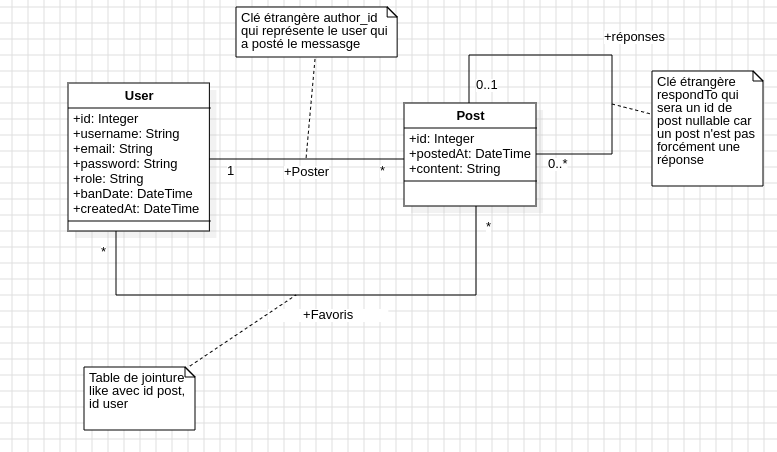

# Réseau Social - Backend
Un backend en PHP/Symfony pour une application de réseau social simple

## Conception
### Use Case

Les fonctionnalités principales sont donc 
* Tout ce qui concerne le fait de se créer un compte utilisateur⋅ice et se connecter
* Poster des messages
* Poster des messages en réponse à d'autres message

### Class

Un aspect intéressant de ce diagramme est le nombre de relations entre les deux mêmes entités avec notamment
* Une relation OneToMany entre User et Post pour indiquer l'author du post, c'est la relation la plus classique
* Une deuxième relation entre User et Post mais cette fois en ManyToMany pour indiquer qui a mis quel Post en favoris
* Une relation OneToMany (ou ManyToOne du coup) entre le Post et lui même pour indiquer si un Post est une réponse à un autre Post. Si sa clé étrangère est nulle, alors le post n'est pas en réponse à quelque chose, sinon elle pointe sur l'id du Post auquel il répond.

## Instructions

### Initialisation de la BDD
1. Si ce n'est pas déjà fait, créer le projet symfony et le projet angular ou cloner les deux à disposition
2. Créer une base de données sur un serveur SQL, peu importe lequel tant que vous savez vous y connecter
3. Créer un fichier database.sql dans le projet symfony avec les CREATE TABLE des 3 tables (deux entités, une table de jointure) avec les email/username du user UNIQUE et y ajouter également des INSERT INTO histoire de pouvoir repartir d'une base propre
4. Créer les deux entités côté symfony en faisant en sorte qu'un Post ait en propriété un autre Post nullable $respondTo ainsi qu'un author de type User

### L'authentification
En suivant les README des projets [symfony-auth](https://github.com/m2i-grenoble-2024/symfony-auth) et [ionic-auth](https://github.com/m2i-grenoble-2024/ionic-auth), créer une authentification JWT avec :
* Les interfaces Symfony sur le User
* Les méthode de répository pour faire persister un User et le récupérer par son username cette fois-ci plutôt que son email
* Le AuthController avec la méthode POST d'inscription qui va vérifier que le username n'existe pas déjà, hasher le mot de passe, assigner une date de création et faire persister le User
* Les fichiers de configuration JWT et security.yaml
* Côté Angular, un formulaire d'inscription et un formulaire de connexion