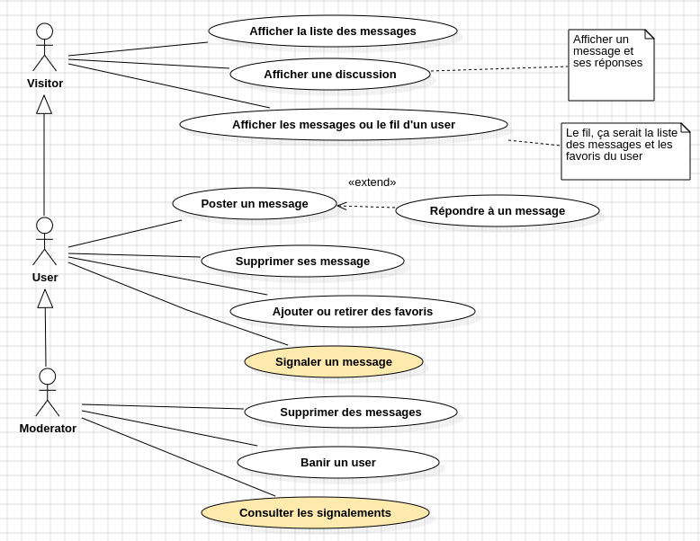

# Réseau Social - Backend
Un backend en PHP/Symfony pour une application de réseau social simple

## Conception
### Use Case

Les fonctionnalités principales sont donc 
* Tout ce qui concerne le fait de se créer un compte utilisateur⋅ice et se connecter
* Poster des messages
* Poster des messages en réponse à d'autres message

### Class

Un aspect intéressant de ce diagramme est le nombre de relations entre les deux mêmes entités avec notamment
* Une relation OneToMany entre User et Post pour indiquer l'author du post, c'est la relation la plus classique
* Une deuxième relation entre User et Post mais cette fois en ManyToMany pour indiquer qui a mis quel Post en favoris
* Une relation OneToMany (ou ManyToOne du coup) entre le Post et lui même pour indiquer si un Post est une réponse à un autre Post. Si sa clé étrangère est nulle, alors le post n'est pas en réponse à quelque chose, sinon elle pointe sur l'id du Post auquel il répond.

## Instructions

### Initialisation de la BDD
1. Si ce n'est pas déjà fait, créer le projet symfony et le projet angular ou cloner les deux à disposition
2. Créer une base de données sur un serveur SQL, peu importe lequel tant que vous savez vous y connecter
3. Créer un fichier database.sql dans le projet symfony avec les CREATE TABLE des 3 tables (deux entités, une table de jointure) avec les email/username du user UNIQUE et y ajouter également des INSERT INTO histoire de pouvoir repartir d'une base propre
4. Créer les deux entités côté symfony en faisant en sorte qu'un Post ait en propriété un autre Post nullable $respondTo ainsi qu'un author de type User

### L'authentification
En suivant les README des projets [symfony-auth](https://github.com/m2i-grenoble-2024/symfony-auth) et [ionic-auth](https://github.com/m2i-grenoble-2024/ionic-auth), créer une authentification JWT avec :
* Les interfaces Symfony sur le User
* Les méthode de répository pour faire persister un User et le récupérer par son username cette fois-ci plutôt que son email
* Le AuthController avec la méthode POST d'inscription qui va vérifier que le username n'existe pas déjà, hasher le mot de passe, assigner une date de création et faire persister le User
* Les fichiers de configuration JWT et security.yaml
* Côté Angular, un formulaire d'inscription et un formulaire de connexion

**Scénario de test:** Lancer le back et le front, aller sur http://localhost:4200 et à partir de là naviguer sur la route /register où on remplit le formulaire d'inscription celui ci nous crée un User dans la base de données et nous redirige vers la route /login. Je remplis les credentials et une fois connecté⋅e je suis redirigé⋅e sur la page d'accueil avec un message de bienvenue + mon username

### Poster un message
1. Côté back, créer un PostRepository avec une méthode add et un INSERT INTO qui aura comme particularité d'aller chercher dans le `$post->getAuthor()->getId()` le author_id de la clé étrangère
2. Créer un PostController avec une Route /api/post en POST (ça va faire beaucoup de posts) qui va récupérer l'entité de la requête (avec un MapRequestPayload), lui assigner la datetime de maintenant en postedAt, récupérer le user connecté avec le $this->getUser() et l'assigner en author avant de lancer la méthode du repository (il faudra donc protéger la route)
3. Côté angular, créer un post-service qui va faire une requête vers la route du controller qu'on vient de créer, rien de particulier
4. Créer ensuite un component add-post qui contiendra un formulaire (soit avec le FormsModule soit avec le ReactiveFormsModule, peu importe) qui n'aura en fait qu'un champ de text pour le contenu du post (tout le reste est assigné automatiquement par le back) et qui au submit va déclencher la méthode du service
5. Charger ce component dans la page d'accueil et ne l'afficher que si on est connecté⋅e

### Afficher les listes des posts
1. Dans le backend, créer un findAll(int $limit, int $offset) dans le PostRepository qui va récupérer les 15 derniers posts en utilisant une requête avec un LIMIT (regarder la doc, en gros on lui dit combien on récupère d'entrée, et combien on en skip) avec un ORDER BY sur le posted_at pour afficher les post les plus récents (si pagination trop compliqué, faire juste un findAll avec order by classique)
2. Créer une méthode GET dans le PostController qui va récupérer une page dans la requête et à partir de cette requête calculer la limit et le offset (genre si c'est page 1, bah la limit c'est 15 et le offset c'est 0, si la page c'est 2, la limit c'est toujours 15 et le offset c'est 15)
3. modifier la requête du findAll pour y faire un INNER JOIN sur la table user, et donc dans la boucle de résultat, on fera également une instance de User pour l'assigner en author du Post